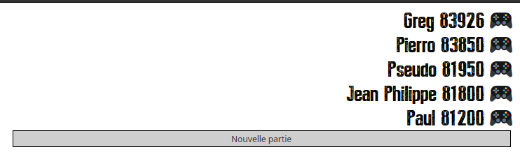
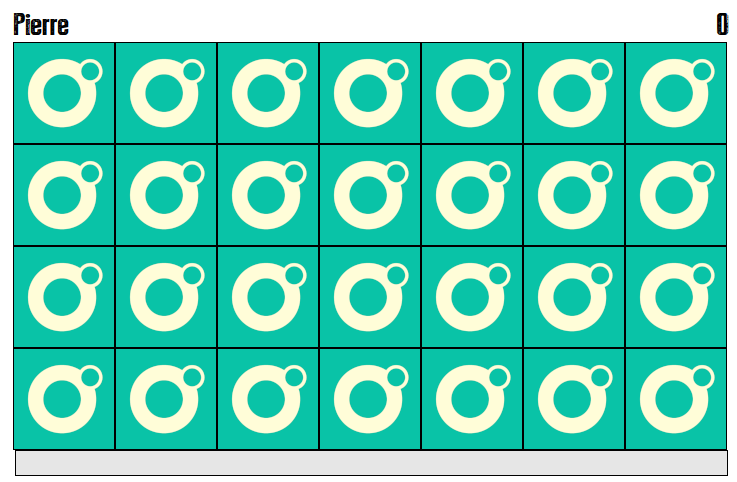
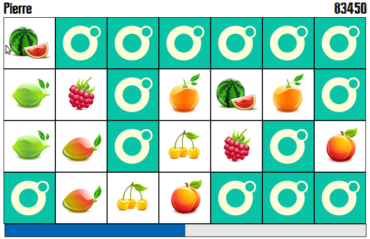
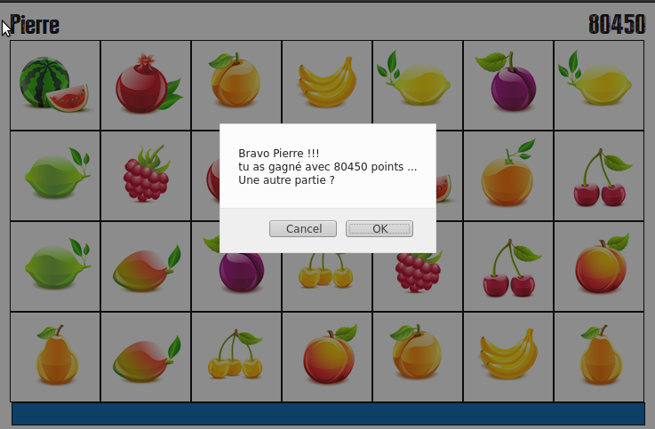
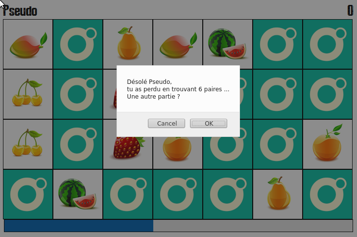

# Jeu de memory - O'Clock

### Le contexte :

Dans le cadre d'une procédure de recrutement pour la société [O'Clock](https://oclock.io/), je devais coder un jeu de memory en Html, Css, Javascript et Php.
Vous trouverez les spécifications fonctionnelles dans le fichier  [Test technique - Full stack.pdf](https://github.com/jpcrevoisier/memory/raw/main/Test%20technique%20-%20Full%20stack.pdf).

Pour des questions de praticité, j'ai voulu rendre le script disponible en ligne a l'adresse [http://jpcrevoisier.free.fr/memory/](http://jpcrevoisier.free.fr/memory/) ce qui a impliqué certaines restrictions du a l'hébergeur comme l'utilisation du php en version 5 ou encore l'absence de fonctionnalités comme la lecture du informations_schema mysql utile pour vérifier la structure des tables.

Vous trouverez donc un répertoire php5 contenant les fichiers déployés chez Free.

Avant toute utilisation prenez le soin soit de modifier le fichier mysqli.inc.php, soit assurez vous d'utiliser les variables d'environement pour une utlisation avec Docker :

- mysql_host
- mysql_user
- mysql_pass
- mysql_base

# Les screenshots

Tel que demandé, voici une série de capture d'écran correspondantes a différentes étapes du jeu :

Tableau des scores

Début de partie

En cours de partie

Partie gagnée

Partie perdue

